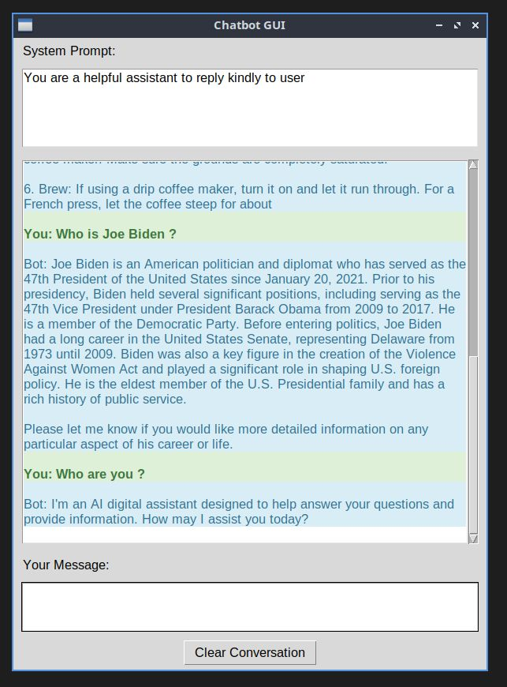

# Chatbot GUI Application using LLAMA.cpp

## Description
This is a simple graphical user interface (GUI) for a chatbot implemented using Python's Tkinter library. The GUI interacts with a command-line script to process user inputs and display responses.



## Setup

### Prerequisites
- Python 3.x
- Tkinter (included with standard Python installations)
- A command-line script `chatbot_script.sh` that processes user input and returns a response.
- LLAMA.cpp installed (see [LLAMA.cpp GitHub](https://github.com/ggerganov/llama.cpp) for installation instructions).

### Installation
1. Clone the repository or download the files.
2. Ensure `chatbot_script.sh` is executable and located in the same directory as the Python scripts.
3. Install any dependencies (Tkinter is typically included with Python, so no additional installation should be needed).
4. Install LLAMA.cpp following the instructions from the [LLAMA.cpp GitHub page](https://github.com/ggerganov/llama.cpp).

```bash
sudo apt-get install python3-tk
python -m venv .pyenv
source .pyenv/bin/activate
pip install -r requirements.txt
```

### Download Model from Hugging Face

```bash
huggingface-cli download "model_name" --local-dir "./models"
```

### Configuration
Update the configuration settings in `config.py` as needed:

```python
WINDOW_SIZE = "600x800"  # Width x Height
SCRIPT_PATH = "/home/cook/Documents/Dev/llama.cpp/main"  # Path to the compiled Llama.cpp script
MODEL_PATH = "/home/cook/Documents/Dev/llama.cpp/models/Phi-3-mini-4k-instruct-q4.gguf"  # Path to the model file
NGL = 32  # Number of layers to offload to the GPU
N = 300  # Number of tokens to generate
C = 2048  # Number of context tokens
REPEAT_PENALTY = 1.0  # Repeat penalty for the model

# User and bot message styling
USER_BG = "#DFF0D8"  # Background of user messages
USER_FG = "#3C763D"  # Foreground (text) color of user messages
BOT_BG = "#D9EDF7"  # Background of bot messages
BOT_FG = "#31708F"  # Foreground (text) color of bot messages

# Font settings
FONT_FAMILY = "Arial"  # Font family
FONT_SIZE = 12  # Font size
FONT_STYLE_USER = ("Arial", 12, "bold")  # Font style for user messages
FONT_STYLE_BOT = ("Arial", 12)  # Font style for bot messages
```

### Running the Application
1. Navigate to the directory containing the files.
2. Run the application using the command:

```bash
python manager.py
```